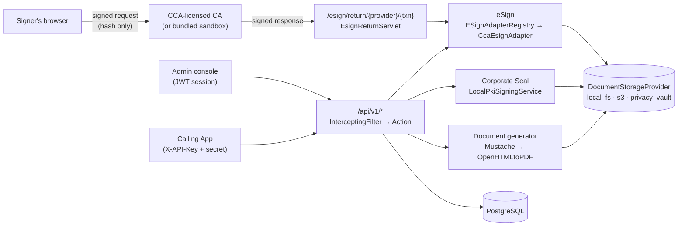
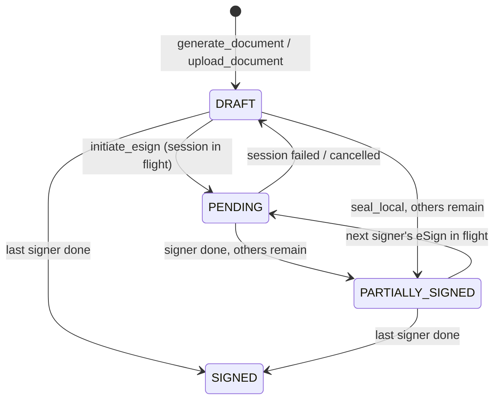
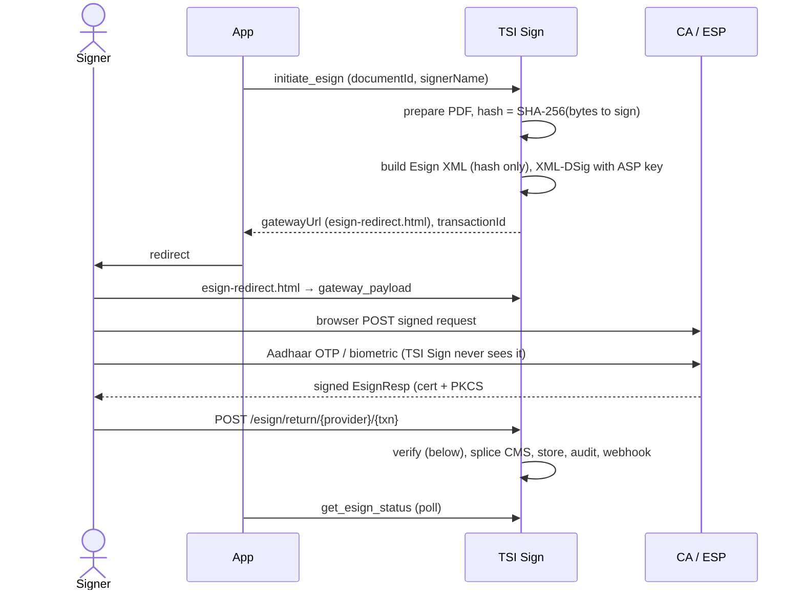

# TSI Sign - Architecture

This is the single design reference for TSI Sign. It describes what is built, why it is shaped that way, and - explicitly - what is not built. Code comments cite sections of this document as "docs/architecture.md §N".

Contents: [1 Overview](#1-overview) · [2 Tenancy and access](#2-tenancy-and-access) · [3 Data model](#3-data-model) · [4 Document lifecycle](#4-document-lifecycle) · [5 Storage](#5-storage) · [6 Signing](#6-signing) · [7 Audit and legal evidence](#7-audit-and-legal-evidence) · [8 Admin console](#8-admin-console) · [9 Deployment and configuration](#9-deployment-and-configuration) · [10 Testing](#10-testing) · [11 Not built, and open decisions](#11-not-built-and-open-decisions)

## 1. Overview

TSI Sign is a self-hosted document execution engine: render a document from an HTML template, get it signed, and keep evidence of everything that happened. One deployment serves one organisation, which exposes the engine to several internal applications ("Apps": a Loan App, an HRMS App, …) that share it but never see each other's data.

Principles that drive the design:

1. **Documents and PII never leave your infrastructure.** Signing with an external CA sends only a SHA-256 hash.
2. **The CA is configuration, not a dependency.** Any CCA-licensed eSign Service Provider speaks the same API; the engine has one generic adapter, configured per CA.
3. **Everything is verifiable without trusting us.** Signatures are standard PAdES (checked with `pdfsig`/Acrobat); the audit trail is hash-chained.
4. **Be honest about assurance.** A self-signed organisation seal proves origin and integrity, not identity; only the CA-backed eSign binds a person. Nothing here has been tested against a real CA (§10).

Stack: Java 17, Maven WAR on Jetty, PostgreSQL, PDFBox + BouncyCastle for PDF/CMS, OpenHTMLtoPDF for rendering, AWS SDK v2 for S3. The admin console is plain HTML/JS with no build step.

**API convention** (shared with tsi-ledger, tsi-dpdp-cms, tsi-privacy-vault): every `/api/v1/*` call is a `POST` with a JSON body whose `_func` selects the operation. A single `InterceptingFilter` looks the path up in `web/WEB-INF/_processor.tsi` (`class|AUTH_MODE`), authenticates, and dispatches to an `Action` that switches on `_func`. The one deliberate exception is the CA's return leg (§6.3), a form-encoded browser POST dictated by the CCA spec, served by a plain servlet.

## 2. Tenancy and access

### 2.1 Apps

An **App** is a registered consumer of the engine. It owns: an API key pair, a template namespace (templates are unique per `(app_id, template_name)`; one App cannot see or render another's), its documents/signers/seals/audit history, optional defaults (`default_provider_id`, `default_key_alias`, `webhook_url`, `storage_provider_id`, `rate_limit_rpm`). The isolation boundary is the App, not an organisation - a deployment *is* one organisation. Apps are provisioned by Platform Admins in the console; they do not self-register.

The model is ported from TSI Ledger. One deliberate deviation: no per-key LIVE/TEST tiers. Environment is a property of the *deployment* (a test deployment is configured only with sandbox CA credentials), so no code path can mix sandbox and production signing.

### 2.2 Authentication

| Mode (`_processor.tsi`) | Credential | Used for |
|---|---|---|
| `TENANT` | `X-API-Key` (public identifier, direct lookup) + `X-API-Secret` (SHA-256 hash compared to `api_keys.api_secret_hash`) | App-facing engine API |
| `CONSOLE` | `Authorization: Bearer <JWT>` for a `platform_user` (stateless; survives restarts; logout revokes the `jti`) | Admin console |
| `TENANT_OR_CONSOLE` | either; the Action branches on `getAppContext(req)` vs the user role | Templates, Documents |
| `PUBLIC` | none; the Action self-gates | setup/login, the eSign gateway-payload lookup |

A failed check returns 401 before any business logic. A resolved App binds an `AppContext` (app id, name, slug, rate limit); every repository call filters by `appId`, and a cross-App lookup returns 404 (not 403) to avoid leaking existence. Keys support issue, rotate and revoke without downtime; the secret is shown once.

**Rate limiting.** `apps.rate_limit_rpm` (null = unlimited) is enforced in the filter at the same short-circuit point as the 401, returning 429.

### 2.3 Roles (console)

`PLATFORM_ADMIN` sees and does everything. `APP_MANAGER` is scoped to Apps assigned in `app_admins` (edit templates/keys, seal, view). `AUDITOR` is read-only across all Apps. Access checks live in `AuthorizationService`; screens are gated per §8. First-run `setup` creates the first Platform Admin; a per-user recovery passphrase supports a "break-glass" password reset.

## 3. Data model

Schema is the numbered scripts in `db/`, run once by Postgres on a fresh volume (no migration library). Scripts 10 and 11 must be applied by hand to a database created before they existed.

| Table | Purpose |
|---|---|
| `apps`, `api_keys`, `platform_users`, `app_admins` | Tenancy and access (§2) |
| `templates` | Per-App HTML templates; `version`, `active` (deactivating blocks new generation but leaves existing documents valid) |
| `documents` | `status` ∈ DRAFT, PENDING, PARTIALLY_SIGNED, SIGNED, EXPIRED; `original_hash`, `sealed_hash`; `storage_provider_id`, `original_storage_key`, `sealed_storage_key`; `archived_at` (separate axis: an archived document is frozen) |
| `document_signers` | One row per party per document; `anchor_element_id` ties a signer to a `[[TSI_SIGNATURE:name]]` marker; `signature_type`; status PENDING/SIGNED/FAILED |
| `document_seals` | One row per applied signature: provider, key alias or transaction id, the PKCS#7, `signature_standard` (PAdES-B-B/B-T), `ca_issuer`, `auth_type` |
| `esign_sessions` | Transient state bridging "hash sent to the CA" and "CA called back": prepared-PDF storage key, exact ByteRange, `gateway_payload`, status INITIATED/COMPLETED/FAILED/EXPIRED |
| `legal_certificates` | Versioned BSA §63 certificates (§7.2) |
| `audit_logs` | Hash-chained event log (§7.1) |
| `system_settings` | Singleton row of deployment settings (storage backend); NULL means "fall back to the env var" |

`storage_provider_id` is denormalised onto each document at write time so changing a backend never strands existing documents.

## 4. Document lifecycle

`generate_document` merges a payload into a Mustache HTML template, renders PDF/A with OpenHTMLtoPDF, stores it as the `original` variant and records `original_hash`. `upload_document` accepts an existing PDF. Signing produces the `sealed` variant; every signature is an incremental update on the latest bytes. Legal certificates require `SIGNED`. Each signature completion fires the App's `webhook_url` (best effort; a broken webhook never fails signing).

## 5. Storage

`DocumentStorageProvider` is a small interface - `store(appSlug, documentId, variant, byte[])`, `retrieve(ref)`, `delete(ref)` - returning a `StorageObjectRef(providerId, storageKey, sha256)`. `variant` is `original` or `sealed`: two independently addressable objects, so the original render can always be re-hashed against `original_hash`, and no code path overwrites a sealed object in place. Key convention: `{app_slug}/{yyyy}/{mm}/{documentId}/{variant}.pdf`.

| `providerId` | Notes |
|---|---|
| `local_fs` (default) | Mounted volume; path-traversal guard; atomic temp-file + move write |
| `s3` | One AWS SDK v2 client for AWS S3 *or* any S3-compatible store (MinIO, Ceph, R2): endpoint, path-style flag, optional SSE-S3/SSE-KMS are config, not separate drivers |
| `privacy_vault` | Delegates to a co-deployed TSI Privacy Vault, inheriting its field-level encryption and access trail |

Resolution: an existing document is always read through the provider stored on its row; a new write uses the App's override, else the deployment default (System Settings or `DEFAULT_STORAGE_PROVIDER_ID`, else `local_fs`). The interface is `byte[]`-based on purpose - every caller already holds the whole PDF, and the checksum is computed inline; switch to streams only if a real large-file case appears. Sovereignty is unaffected: `local_fs` and self-hosted S3 keep an air-gapped deployment fully in-house.

## 6. Signing

### 6.1 Signature placeholders and the visible stamp

A template author places `[[TSI_SIGNATURE:name]]` (or bare `[[TSI_SIGNATURE]]`, meaning `default`) as plain text, styled near-invisible (`color:#fff; font-size:1px`). After rendering, `SignaturePlaceholderLocator` (a `PDFTextStripper`) records each marker's page and position; `VisibleSignatureStamper` draws a stamp there (who/what signed, reason, date). One marker becomes the real signature widget - PDFBox merges it in the same incremental save that carries the CMS - and any others are overlay stamps. A template with no marker gets an invisible signature, as before. For the Corporate Seal the stamp includes a "Signed by" line: the console user's email, or `App: <slug>` for an API call. The stamp is a visual aid; the CMS signature covers the whole document either way. No QR code and no public verification endpoint exist by choice: exposing integrity data without auth is a separate decision.

### 6.2 Corporate Seal (`seal_local`)

Synchronous, server-side, no network. `LocalPkiSigningService` signs with a key from a local PKCS#12 keystore (`LocalKeyStoreProvider`; alias from the request, else the App's `default_key_alias`, else `DEFAULT_KEY_ALIAS`), producing a CAdES-detached PAdES-B-B signature (B-T with a TSA, §6.5).

**Decision:** the seal is a self-signed or private-CA certificate for the organisation - proof of origin and immutability (IT Act s.3), not identity, and not a Class 3 certificate. Externally verified identity belongs to Aadhaar eSign. Hardware-token/HSM sealing is out of scope (the signing call only needs a `KeyStore.PrivateKeyEntry`, so it could be added behind a new key provider later). Sealing is on demand; there is no background job that auto-seals newly generated documents.

### 6.3 Aadhaar eSign - bring your own CA

Legally: an IT Act s.3A electronic signature (Second Schedule), tied to a named individual, issued on demand by a CCA-licensed ESP the deployer contracts with.

**Why two phases.** PDFBox's external-signing state lives in a live `COSWriter` that cannot survive the minutes-long redirect gap. So `ExternalCmsSpliceService.prepare` reserves signature space, draws the stamp, and extracts only two plain values - the exact bytes to hash (`ExternalSigningSupport.getContent()`) and the `ByteRange` - persisted in `esign_sessions` (the bytes via the storage provider). `finalizeSignature` later re-inserts a same-length `<hex…0>` block at `ByteRange[1]` to rebuild the complete file: no PDFBox object needed in phase two.

**Adapters.** `ESignAdapter` = `initiateSigning`, `processCallback(payload, expectedHashHex)`, `getProviderId`, `getDisplayName`. `ESignAdapterRegistry` maps provider ids to a `CcaEsignAdapter` configured from `ESIGN_<PROVIDER>_*` env (§9); a CA whose API genuinely departs from the CCA spec would get its own implementation registered there. Providers: `sandbox`, `cca_generic`, `emudhra`, `cdac`, `protean`, `vsign`, `capricorn`, `xtratrust`. Resolution mirrors storage: an in-flight session always finishes with the provider stored on it; a new one uses the request's `providerId`, else the App's `default_provider_id` if it names an eSign provider (that field is shared with local sealing, so `local_pki` is skipped, not an error), else `DEFAULT_ESIGN_PROVIDER_ID`.

**Trust model.** The return endpoint is unauthenticated (it is a browser POST), so nothing is acted on until the adapter verifies, in order: (1) the response XML signature is by the **pinned** ESP certificate - chaining to the CA is *not* enough, since any customer of that CA holds such a certificate; (2) the PKCS#7's signed digest is exactly the hash we sent; (3) the signer certificate chains to the configured CA certificates and verifies the signature. An unverifiable callback changes no state (audited as `ESIGN_CALLBACK_REJECTED`); only an *authenticated* failure from the CA (cancel, wrong OTP) fails a session. Session status and a `sealed_hash` compare-and-set guard replays and races. Not done: OCSP/CRL checking of the ~30-minute signer certificate.

**ASP request-signing key.** The CCA spec requires every request to be XML-DSig signed with a certificate issued *to the ASP* - separate from the signer's key, which the ESP creates in its own HSM and destroys after one use. That key is currently read from a PKCS#12 keystore (`ESIGN_
_ASP_KEY_ALIAS`, default `tsi_asp_signing`). It signs on behalf of a regulated entity, so KMS/HSM/Vault custody (rotation without redeploy, per-use audit) is the intended hardening; KMS/Vault typically sign a digest rather than produce an XML-DSig envelope, so canonicalisation would stay app-side with only the raw signature delegated. Open: what a given CA's ASP onboarding actually issues (a `.pfx` or HSM provisioning), and which CCA API track it puts you on. A shared KMS abstraction with any future client-side document encryption is worth deciding once.

### 6.4 Multi-signature documents

A document can collect several independent signatures over time (a borrower's eSign, then an officer's seal). PDF supports this natively - each signature is an incremental update whose ByteRange spans everything before it, including prior signatures, so each re-attests the file. Mechanics:

- `document_signers.anchor_element_id` binds a signer to a named marker; `signerName` on `seal_local`/`initiate_esign` targets exactly one marker and leaves the rest untouched (omitted → stamp every marker as one signer, the original behaviour).
- Each call signs the *latest* bytes (`sealed_storage_key`, else `original_storage_key`).
- Guards: status must be DRAFT or PARTIALLY_SIGNED; the targeted signer must not already be SIGNED; no other eSign session may be in flight on the document.
- Concurrency is optimistic: the final update is conditional on `sealed_hash` still matching what was read; a mismatch fails with a retryable error rather than losing a signature.
- Signing order is recorded (`signer_order`) but **not enforced**; enforcing it is a small follow-on. The legal certificate does not yet enumerate each signer.

### 6.5 Signature standards and timestamping

Signatures are **PAdES-B-B**. With `TSA_URL` set, `SignatureTimestamper` embeds an RFC 3161 time-stamp token over the signature value (unsigned attribute `id-aa-signatureTimeStampToken`), giving **PAdES-B-T**: proof the signature existed at a time, even after the signer's certificate expires. The token is only accepted if its signer chains to `TSA_TRUST_CERTS` and carries the timestamping EKU. `TSA_REQUIRED=true` fails signing if the TSA is down; otherwise it degrades to B-B, and `document_seals.signature_standard` records which was applied. **Not implemented:** PAdES-B-LT/LTA (embedded OCSP/CRL and a document time-stamp), i.e. long-term validation.

## 7. Audit and legal evidence

### 7.1 Hash-chained audit trail

Every lifecycle event writes an `audit_logs` row (actor type APP / PLATFORM_USER / SYSTEM, IP, user agent) whose `entry_hash` is the SHA-256 of its length-prefixed fields plus the previous row's hash for the same App, written under a per-App advisory lock so writers never fork the chain. Console → Audit → *Verify integrity* (`verify_chain`) recomputes a chain and reports the first edited, removed, reordered or injected entry. Limits: it cannot detect removal of the *newest* entries or a database administrator rewriting the whole chain - record the printed head hash outside the database to close that. Rows written before the chain existed are outside it.

### 7.2 BSA §63 legal certificate

Under the Bharatiya Sakshya Adhiniyam 2023 §63, an electronic record is primary evidence when accompanied by a §63(4) certificate (Part A: the system and its operating status; Part B: how the record was produced and last modified). For a server-side engine the honest mapping is: Part A = the generating TSI Sign instance and the calling App; Part B = template and version, the generator version, and the hashes at each state transition from `audit_logs`. `generate_legal_certificate` assembles both parts, renders a certificate PDF, seals it with a caller-supplied `certifyingKeyAlias`, and stores it as a new version (never mutating a sealed one). The certificate states its own scope boundary: it attests to what TSI Sign did (render, hash, seal), not to what happens to a downloaded file afterwards. **Caveat:** the certificate wording must be reviewed by qualified counsel before being presented as §63-compliant. Not built: a Certifying Officers screen and a counsel-approval gate.

## 8. Admin console

Screens (`web/console/`): Dashboard, Apps (list; detail with overview, API keys, signing defaults, rate limit, storage override, admins), Templates (editor with preview and generate-test-document; activate/deactivate), Documents (list, detail with per-signer status, audit timeline, sign actions, archive), Legal Evidence (registry and certificate detail), Audit (cross-App log and integrity check), Platform Users, System Settings (storage backend), plus the eSign redirect page.

| Screen | PLATFORM_ADMIN | APP_MANAGER | AUDITOR |
|---|---|---|---|
| Dashboard, Documents, Audit, Legal Evidence (view) | all Apps | scoped Apps | all Apps, read-only |
| Apps create / archive | yes | no | no |
| Apps edit, API keys, Templates, sealing | yes | scoped Apps | no |
| Platform Users, System Settings | yes | no | no |

Not built: an eSign Providers & PKI screen (providers are configured by environment), keystore upload/rotate, template version history with rollback, bulk export.

## 9. Deployment and configuration

`docker compose up -d` starts Postgres, the app on Jetty (host port 8088) and the eSign sandbox (8090). Configuration is environment variables; the full list is in the README. Groups: database and JWT; storage (`STORAGE_*`, `S3_*`, `PRIVACY_VAULT_*`, overridable live in System Settings); local seal keystore (`KEYSTORE_*`, `DEFAULT_KEY_ALIAS`); eSign (`PUBLIC_BASE_URL`, `DEFAULT_ESIGN_PROVIDER_ID`, `ESIGN_
_URL|ASP_ID|ESP_CERT|TRUST_CERTS|ASP_KEY_ALIAS|VERSION|AUTH_MODE`); timestamping (`TSA_*`). `PUBLIC_BASE_URL` must be reachable **by the signer's browser**, because the browser carries both legs of an eSign. The image bakes in a self-signed dev seal key (`tsi_corporate_seal`) and a dev ASP key (`tsi_asp_signing`); replace both for anything real.

## 10. Testing

- **Unit/integration (`mvn test`):** storage providers, adapter registry, audit-hash properties, and - when `SANDBOX_URL` is set - the adapter round trip against a running sandbox, ending in a real PDF whose signature is verified independently by BouncyCastle, including the attack and failure cases and time-stamping.
- **`sandbox/`:** a standalone service (own Maven module, not in the WAR) that plays a CCA-licensed ESP *and its CA and TSA*: it verifies the signed request, shows an OTP page (OTP `123456`), issues a short-lived signer certificate from its own root, signs the hash, and returns a signed response. The consent page simulates cancel, expiry, provider error, and two attacks the engine must reject (the ESP signing a different hash; a response signed by a merely CA-chained certificate). It is a **fixture, not a CA anyone should trust**, and proves protocol mechanics only.
- **End-to-end:** `examples/integration/` scripts drive the real HTTP API (`ESIGN_AUTOMATE=1` plays the browser against the sandbox); `pdfsig` confirms the signatures are valid.
- **Not tested:** any real CCA-licensed CA. Provider profiles other than `sandbox` are config-only until run against that CA's own sandbox; quirks (endpoint version, callback shape) are expected on first contact.

## 11. Not built, and open decisions

**Not built (deliberately or not yet):**

| Item | Note |
|---|---|
| Class 3 / hardware-token / HSM sealing | Out of scope by decision (§6.2) |
| Auto-seal background job | Sealing is on demand |
| Enforced signing order | Recorded, not gated (§6.4) |
| PAdES-B-LT/LTA, OCSP/CRL checking | §6.3, §6.5 |
| KMS/HSM-held ASP key | §6.3 |
| Ephemeral (zero-retention) mode | Would be an `apps.retention_mode` flag checked before storing the sealed variant; needs a decision on what `sealed_storage_key` means then (likely NULL forever, with `document_seals`/`audit_logs` as the only durable record) |
| Client-side envelope encryption; encryption at rest | Not implemented for any backend. Would wrap `store()`/`retrieve()` uniformly with a pluggable customer-controlled KMS, not per driver |
| WORM / S3 Object Lock | Would be config on the `s3` provider (retention per `PutObject` on the sealed variant), not a new interface method |
| GCS / Azure Blob / Postgres BYTEA storage | Only on customer demand; check GCS's S3-interoperability API before writing a native driver; BYTEA trades one backup story for bloating the primary DB. No jclouds/Spring abstraction - the interface is already the abstraction |
| Certifying Officers screen, counsel-approval gate | §7.2 |
| eSign Providers & PKI console screen; keystore upload/rotate | §8 |
| Public verification endpoint / QR stamp | Removed by choice (§6.1) |
| Per-signer notifications | The per-completion webhook is enough for an App to build them |

**Open decisions:** whether Platform Admins should publish shared starter templates Apps can clone; a mandatory key-rotation interval versus rotation on demand; a single deployment-wide certifying officer key versus one per App; what a specific CA's ASP onboarding issues and which CCA API track it uses; whether GCS interop covers CMEK needs.

**History.** The original design (Aug 2026) planned an eMudhra-first adapter and an in-process mock. When ASP onboarding stalled, the design was recast as vendor-agnostic (bring your own CA) with one generic adapter and a protocol-level sandbox. The earlier planning documents were folded into this one; see git history (`prep/`, before this consolidation) for their original text. Older code comments that cite bare section numbers or "Chunk N" (e.g. "§10.9") refer to that original plan, not to this document; comments that cite "docs/architecture.md §…" refer to this one.
