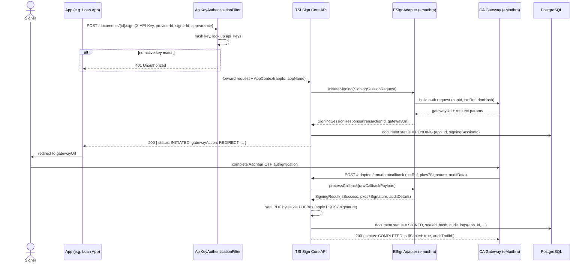
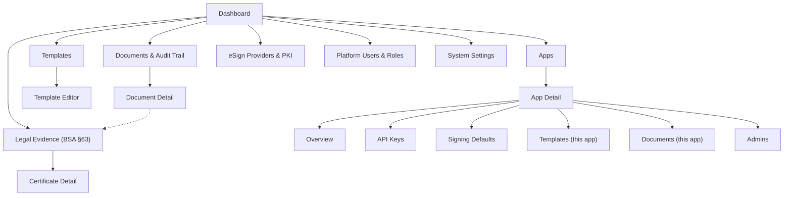

# TSI Sign: Multi-App Architecture — Implementation Plan

**Status:** Draft v1.0
**Date:** 2026-08-24
**Author:** TSI Coop Engineering (prepared with Claude)

## 1. Purpose

TSI Sign is currently designed as a single-tenant document execution engine scoped by `organizations`. This plan restructures it around an **App** concept — the same pattern already proven in **TSI Ledger Service** — so that one self-hosted TSI Sign deployment can serve multiple internal applications (e.g. **Loan App**, **HRMS App**, **Vendor App**) as isolated, independently-keyed consumers of a single shared document generation, PKI, and signing engine.

This is **not** multi-tenancy across organizations. TSI Sign remains a single-org, self-hosted deployment. The isolation boundary is the **App**, not the org — mirroring TSI Ledger's model where "the system serves external applications ('Apps'), allowing them to manage independent [resources] securely," with "data remain[ing] logically isolated per App."

## 2. Reference Pattern: TSI Ledger's App Model

TSI Ledger already solves this exact problem for the accounting domain. We port its core mechanics directly:

| TSI Ledger concept | Mechanism |
|---|---|
| `App` entity | Primary tenant wrapper: unique ID, app name, hashed API key(s) |
| Auth | Every request carries `X-API-Key`; header is hashed and matched against the app's key index |
| Isolation | Every domain table carries `app_id`; an app can never read/write another app's rows |
| Key tiers | Two-tier key structure (`live` / `test`) mapped to an active App context |
| Failure mode | No matching app context → immediate `401 Unauthorized`, request terminates before touching business logic |

TSI Sign adopts the identical shape: `apps` replaces `organizations` as the top-level scoping entity; `app_id` replaces `org_id` on every table that currently references it. **One deviation:** TSI Sign does not adopt Ledger's per-key `live`/`test` tiering — see §4.2 for why.

## 3. Core Concept: the `App`

An **App** is a registered consumer of the TSI Sign engine — one per business system (Loan App, HRMS App, Vendor App, ...). Each App gets:

- Its own **API key pair** (live + test), used to authenticate every request via `X-API-Key`.
- Its own **template namespace** — Loan App cannot see or generate from HRMS App's templates, and vice versa.
- Its own **signer pool** and document/audit history, fully isolated from other Apps.
- An optional **default signing identity** — which local PKI keystore alias and/or which eSign adapter (`emudhra`, `cdac`, ...) the app uses by default, since a Loan App's corporate seal is legally distinct from an HRMS App's.
- Its own **webhook endpoint(s)** for signing-completion callbacks.

Apps are provisioned and managed by **Platform Admins** through an internal admin console/API — this is an operational control plane, not something each App self-registers into.

## 4. Data Model Changes

### 4.1 New/changed tables

```sql
-- Enable UUID extension
CREATE EXTENSION IF NOT EXISTS "uuid-ossp";

-- 1. APPS (replaces ORGANIZATIONS as the top-level scoping entity)
CREATE TABLE apps (
    app_id          UUID PRIMARY KEY DEFAULT uuid_generate_v4(),
    app_name        VARCHAR(255) NOT NULL,
    app_slug        VARCHAR(100) NOT NULL UNIQUE,       -- e.g. "loan-app", "hrms-app", "vendor-app"
    is_active       BOOLEAN NOT NULL DEFAULT TRUE,
    default_provider_id     VARCHAR(50),                -- e.g. 'emudhra', 'local_pki'
    default_key_alias       VARCHAR(255),                -- default local PKI seal for this app
    webhook_url              TEXT,
    created_at      TIMESTAMPTZ NOT NULL DEFAULT CURRENT_TIMESTAMP,
    updated_at      TIMESTAMPTZ NOT NULL DEFAULT CURRENT_TIMESTAMP
);

-- 2. API KEYS (supports rotation & revocation independent of Ledger's single-column approach;
--    no LIVE/TEST tiering — environment is a deployment-level property, see §4.2)
CREATE TABLE api_keys (
    key_id          UUID PRIMARY KEY DEFAULT uuid_generate_v4(),
    app_id          UUID NOT NULL REFERENCES apps(app_id) ON DELETE CASCADE,
    key_hash        VARCHAR(64) NOT NULL UNIQUE,        -- SHA-256 of the raw key; raw key shown once at creation
    key_prefix      VARCHAR(12) NOT NULL,               -- first chars, for display/audit ("sk_9f2a...")
    is_active       BOOLEAN NOT NULL DEFAULT TRUE,
    created_at      TIMESTAMPTZ NOT NULL DEFAULT CURRENT_TIMESTAMP,
    revoked_at      TIMESTAMPTZ
);
CREATE INDEX idx_api_keys_hash ON api_keys(key_hash) WHERE is_active = TRUE;

-- 3. PLATFORM USERS (internal ops/admin users — not per-App end users)
CREATE TABLE platform_users (
    user_id         UUID PRIMARY KEY DEFAULT uuid_generate_v4(),
    email           VARCHAR(255) NOT NULL UNIQUE,
    full_name       VARCHAR(255) NOT NULL,
    role            VARCHAR(50) NOT NULL DEFAULT 'APP_MANAGER', -- PLATFORM_ADMIN | APP_MANAGER | AUDITOR
    created_at      TIMESTAMPTZ NOT NULL DEFAULT CURRENT_TIMESTAMP
);

-- 4. APP <-> PLATFORM USER scoping (an APP_MANAGER may only administer specific apps)
CREATE TABLE app_admins (
    app_id          UUID NOT NULL REFERENCES apps(app_id) ON DELETE CASCADE,
    user_id         UUID NOT NULL REFERENCES platform_users(user_id) ON DELETE CASCADE,
    PRIMARY KEY (app_id, user_id)
);

-- 5. TEMPLATES (namespaced per app instead of global)
CREATE TABLE templates (
    template_id     UUID PRIMARY KEY DEFAULT uuid_generate_v4(),
    app_id          UUID NOT NULL REFERENCES apps(app_id) ON DELETE CASCADE,
    template_name   VARCHAR(255) NOT NULL,
    category        VARCHAR(100),
    html_content    TEXT NOT NULL,
    version         INT NOT NULL DEFAULT 1,
    created_at      TIMESTAMPTZ NOT NULL DEFAULT CURRENT_TIMESTAMP,
    updated_at      TIMESTAMPTZ NOT NULL DEFAULT CURRENT_TIMESTAMP,
    CONSTRAINT uq_app_template_name UNIQUE (app_id, template_name)
);

-- 6. DOCUMENTS (app_id replaces org_id)
CREATE TABLE documents (
    document_id     UUID PRIMARY KEY DEFAULT uuid_generate_v4(),
    app_id          UUID NOT NULL REFERENCES apps(app_id) ON DELETE CASCADE,
    template_id     UUID REFERENCES templates(template_id),
    title           VARCHAR(255) NOT NULL,
    file_path       TEXT NOT NULL,
    original_hash   VARCHAR(64) NOT NULL,
    sealed_hash     VARCHAR(64),
    status          VARCHAR(30) NOT NULL DEFAULT 'DRAFT',
    created_at      TIMESTAMPTZ NOT NULL DEFAULT CURRENT_TIMESTAMP,
    updated_at      TIMESTAMPTZ NOT NULL DEFAULT CURRENT_TIMESTAMP,
    expires_at      TIMESTAMPTZ
);
CREATE INDEX idx_documents_app ON documents(app_id, created_at DESC);

-- document_signers, document_seals, audit_logs keep their existing shape
-- (document_id FK), and inherit app scoping transitively through documents.
-- audit_logs additionally denormalizes app_id for fast per-app queries:
ALTER TABLE audit_logs ADD COLUMN app_id UUID NOT NULL REFERENCES apps(app_id);
CREATE INDEX idx_audit_logs_app ON audit_logs(app_id, created_at DESC);
```

> `documents.file_path` above is superseded by the storage-provider columns introduced in §5.3 — shown here first because it reflects the original architecture doc; §5.3 is the column set that actually ships.

### 4.2 Key architectural decisions

- **`apps` replaces `organizations`** as the top-level scoping entity everywhere. There is no org layer above it — a single deployment *is* one org.
- **`api_keys` is a separate table**, not a single hash column on `apps` (unlike Ledger's minimal `fiduciary_apps.api_key_hash`). TSI Sign needs key rotation without app downtime — an App must be able to issue a new key and revoke the old one without regenerating its identity.
- **No per-key LIVE/TEST tiering (resolved decision):** environment separation is a *deployment*-level property, not a per-key one. A TSI Sign instance is deployed as either a TEST instance (configured only with sandbox eSign adapter credentials, §10.6) or a LIVE instance (configured only with production credentials) — never both at once. There is no code path by which a LIVE deployment could accidentally produce a sandbox-signed document or vice versa, so no `environment` column, no `document.environment` flag, and no intra-deployment routing logic are needed. This also means `AppContext` carries no `environment` field (§6).
- **Templates are namespaced per App** (`uq_app_template_name`), so Loan App and HRMS App can each have an "Offer Letter" template without collision, and neither can enumerate or render the other's templates even with a valid API key.
- **`default_provider_id` / `default_key_alias` on `apps`** let each App default to its own eSign adapter and/or PKI seal — a Loan App agreement sealed with the lending entity's certificate is legally distinct from an HRMS App offer letter sealed with HR's certificate. Per-document override remains possible via the existing `seal-local` / `sign` payloads.
- **RBAC is App-scoped for `APP_MANAGER`** via `app_admins`, so one platform user can be restricted to only the Loan App's templates/documents while another oversees all three apps. `PLATFORM_ADMIN` bypasses this scoping; `AUDITOR` is read-only across all apps.

## 5. Document Storage

TSI Sign's storage layer is pluggable, following the same abstraction pattern as `ESignAdapter` (§7). This keeps the sovereignty pitch — "documents... never touch an external vendor's cloud storage" — true regardless of which backend a given deployment picks, and lets a deployment start on local disk and move to object storage later without any application-code change.

```java
package org.tsicoop.sign.storage;

public interface DocumentStorageProvider {
    String getProviderId();   // "local_fs", "s3", "privacy_vault"

    StorageObjectRef store(String appId, String documentId, String variant, byte[] content)
        throws StorageException;

    byte[] retrieve(StorageObjectRef ref) throws StorageException;

    void delete(StorageObjectRef ref) throws StorageException;
}

public record StorageObjectRef(
    String providerId,
    String storageKey,
    String sha256Checksum
) {}
```

`variant` is `"original"` (the freshly rendered, unsigned PDF) or `"sealed"` (the signed/sealed PDF) — kept as two distinct objects so the original render can always be independently re-hashed and verified against `documents.original_hash`, even long after sealing.

Storage key convention: `{app_slug}/{yyyy}/{mm}/{documentId}/{variant}.pdf` — human-navigable per App and month even on backends without native folder browsing (S3).

### 5.1 Storage options

| Option | `providerId` | Best for | Notes |
|---|---|---|---|
| **Local filesystem** | `local_fs` | Single-node self-hosted deployments; Phase 1 default | Writes to a mounted Docker volume (e.g. `/data/tsi-sign/documents`). Zero external dependency, simplest to reason about, backup = disk/volume snapshot. Doesn't scale across multiple app instances without a shared/NFS mount. |
| **S3-compatible object storage** | `s3` | Multi-node / HA production deployments | Same AWS SDK v2 client works against AWS S3 *or* a self-hosted S3-compatible store (MinIO, Ceph RGW, SeaweedFS) — an org can stay fully self-hosted and still get object versioning, lifecycle rules (auto-expire per `documents.expires_at`), and horizontal scale. Config: endpoint URL, bucket, access/secret key or IAM role, path-style addressing (needed for MinIO), optional SSE-S3/SSE-KMS. |
| **TSI Privacy Vault** | `privacy_vault` | Orgs already running TSI Privacy Vault, or documents carrying sensitive PII (Aadhaar/PAN-bearing loan agreements, HR records) | Delegates the `FILES` store to a co-deployed TSI Privacy Vault instance — inherits its field-level encryption, blind-search indexing, and forensic "who accessed what, when, from which device" trail as a second, independent audit layer on top of TSI Sign's own `audit_logs`. Config: Vault base URL + API key. |

`local_fs` ships in Phase 1; `s3` and `privacy_vault` are pluggable additions that require no schema change — only a new `DocumentStorageProvider` implementation and config entry.

### 5.2 Per-App vs. deployment-wide configuration

The active storage backend is a **deployment-wide** setting (System Settings, §10.7) in the common case — most self-hosted installs run a single backend. `apps.storage_provider_id` (nullable, optional override) lets a specific App be pinned to a different backend when needed — e.g. Loan App required by internal policy to keep agreements in `privacy_vault` while HRMS App and Vendor App use plain `local_fs` or `s3`.

```sql
ALTER TABLE apps ADD COLUMN storage_provider_id VARCHAR(50); -- NULL = use deployment default
```

### 5.3 Documents table: storage columns

`file_path` (a single path string, §4.1) is replaced with an explicit provider plus two object references — a document has two distinct binary states worth keeping independently addressable:

```sql
ALTER TABLE documents
    DROP COLUMN file_path,
    ADD COLUMN storage_provider_id  VARCHAR(50) NOT NULL,   -- denormalized at write time
    ADD COLUMN original_storage_key TEXT NOT NULL,
    ADD COLUMN sealed_storage_key   TEXT;                    -- NULL until signed
```

Denormalizing `storage_provider_id` onto the row — rather than always resolving the App's *current* default — means changing an App's storage backend going forward never strands or breaks retrieval of documents already written under the old one.

### 5.4 Encryption at rest

`local_fs` and `s3` can optionally wrap payloads in AES-256 envelope encryption at the storage-provider layer (a deployment-level key, config flag) for orgs that want encryption without running the full Privacy Vault. `privacy_vault` already guarantees this natively as part of its own storage contract.

## 6. Authentication & Request Flow

Every business API call (document generation, signing, seal-local) requires `X-API-Key`:

1. Filter/interceptor hashes the incoming key (SHA-256) and looks it up in `api_keys` where `is_active = TRUE`.
2. No match → `401 Unauthorized`, request terminates before reaching any service logic (identical to Ledger's rule).
3. Match found → resolve `AppContext(appId, appName)` and bind it request-scoped (e.g. `ThreadLocal` / CDI `@RequestScoped` bean).
4. Every downstream repository call implicitly filters by `appId` — no query path can accidentally cross app boundaries.

There is no per-request environment (LIVE/TEST) branching here — that concern is resolved at the deployment level (§4.2): a TEST deployment only ever has sandbox eSign adapter credentials configured, a LIVE deployment only ever has production ones, so `AppContext` carries no `environment` field and there's no `document.environment` flag to worry about.

Platform/admin endpoints (`/api/v1/admin/**` — creating Apps, issuing keys, template management UI) use a **separate session-based auth** for `platform_users`, not `X-API-Key`.

### New/changed Java interfaces

```java
package org.tsicoop.sign.app;

public record AppContext(
    String appId,
    String appName
) {}
```

```java
package org.tsicoop.sign.security;

public interface ApiKeyAuthenticator {
    // Returns empty if no active key matches; never throws on bad input.
    Optional<AppContext> resolve(String rawApiKey);
}
```

A `Filter` (`ApiKeyAuthenticationFilter`) wraps every `/api/v1/**` (non-admin) route, calls `ApiKeyAuthenticator.resolve`, and rejects with 401 on empty result — otherwise binds `AppContext` for the request lifetime.

## 7. eSign Adapter Flow (Sequence Diagram)

The `ESignAdapter` interface (see the Technical Architecture doc) decouples the core engine from any specific Certifying Authority. Every signing call is resolved to an `AppContext` first (§6), then dispatched to the adapter matching `providerId` — either an external CA gateway (eMudhra, C-DAC) via a redirect + callback round-trip, or the Local PKI adapter, which seals synchronously with no network hop.

**External CA flow** (e.g. `providerId = emudhra`, Aadhaar OTP):



**Local PKI flow** (`providerId = local_pki`, no external CA, no redirect):

```mermaid
sequenceDiagram
    actor Caller
    participant App as App (e.g. HRMS App)
    participant Filter as ApiKeyAuthenticationFilter
    participant Core as TSI Sign Core API
    participant KS as Local KeyStore (.pfx / .jks)
    participant DB as PostgreSQL

    App->>Filter: POST /documents/{id}/seal-local (X-API-Key, keyAlias?, reason, location)
    Filter->>Filter: resolve AppContext; fall back to apps.default_key_alias if keyAlias omitted
    Filter->>Core: forward request + AppContext
    Core->>KS: load key by alias, sign PDF bytes (PAdES-B-B)
    KS-->>Core: signed PDF bytes + SHA-256 checksum
    Core->>DB: document.status = SIGNED, sealed_hash, audit_logs(app_id, ...)
    Core-->>App: 200 { status: SIGNED, signatureStandard: PAdES-B-B, sealedAt, sha256Checksum }
```

The two flows share everything downstream of `processCallback()` / the KeyStore call — PDF sealing, hash computation, `documents`/`audit_logs` persistence — so adding a new CA (e.g. SHCIL) means writing one new `ESignAdapter` and never touches this shared tail.

## 8. API Changes

All existing endpoints from the current technical architecture carry forward unchanged in shape, but now implicitly scoped by the resolved `AppContext`:

| Endpoint | Change |
|---|---|
| `POST /api/v1/templates` | Requires `X-API-Key`; template created under caller's `appId` |
| `POST /api/v1/templates/{templateId}/generate` | 404 (not 403) if `templateId` doesn't belong to caller's app — avoid leaking existence across apps |
| `POST /api/v1/documents/{documentId}/sign` | Unchanged payload; `documentId` resolution scoped to `appId` |
| `POST /api/v1/documents/{documentId}/seal-local` | If no `keyAlias` supplied, falls back to `apps.default_key_alias` |
| `POST /api/v1/adapters/{providerId}/callback` | Callback payload's `txnRef` resolves back to a `documentId` → `appId`; no `X-API-Key` on inbound CA webhooks, so `txnRef` must be an unguessable, single-use token |

### New admin endpoints (session-auth, Platform Admin / App Manager only)

```
POST   /api/v1/admin/apps                          Create a new App
GET    /api/v1/admin/apps                           List apps (scoped by RBAC)
GET    /api/v1/admin/apps/{appId}                    App detail + key metadata (never returns raw keys)
POST   /api/v1/admin/apps/{appId}/keys               Issue a new key (returns raw key once)
POST   /api/v1/admin/apps/{appId}/keys/{keyId}/revoke Revoke a key
GET    /api/v1/admin/apps/{appId}/documents           Audit view of an app's document history
GET    /api/v1/admin/apps/{appId}/usage               Volume/quota dashboard (Phase 3+)
```

## 9. Legal Evidence Support (BSA §63)

Under the **Bharatiya Sakshya Adhiniyam, 2023** (BSA — India's Evidence Act, in force from 1 July 2024), electronic records are admissible as *primary* evidence under **Section 63**, provided they're accompanied by a certificate under Section 63(4) — the direct successor to the old Section 65B certificate under the Indian Evidence Act, 1872. That certificate has two parts: a **Part A** (identifying the device/system involved and its operating condition) and a **Part B** (expert particulars — how the record was produced, last modified, and output), and it must be signed by a person "occupying a responsible official position."

> **Caveat:** the exact certificate schedule wording and evidentiary requirements should be validated with legal counsel before this ships — this section designs the *technical capability* to auto-populate and seal that certificate from data TSI Sign already captures, not a legal opinion on sufficiency.

### 9.1 What "the device" means for a server-side engine

TSI Sign is a backend document engine, not an end-user editing app — there's no personal laptop/phone whose make, model, and serial number are meaningful to capture. The honest mapping of Part A/B to TSI Sign's architecture is:

- **Part A (system identification & operating status)** → the *generating system*: the TSI Sign server instance (hostname/container ID) and the calling App's identity (`AppContext.appId` / `appName` resolved in §6), plus a "system healthy" status snapshot at generation time.
- **Part B (last-edit tracking & output particulars)** → the *generation pipeline*: template + version used, `DocumentGeneratorService` / OpenHTMLtoPDF+PDFBox engine version, the exact timestamp and hash at each state transition (already captured in `audit_logs`), and the "print/output" equivalent — the PDF generator's version string, since there is no physical printer in this flow.
- If a document is later downloaded and printed outside TSI Sign, that downstream event is outside the engine's visibility — the certificate can only attest to what TSI Sign itself did (render, hash, seal), not to anything that happens to the file afterward. This scope boundary should be stated plainly on the certificate itself.

### 9.2 Data model

```sql
CREATE TABLE legal_certificates (
    certificate_id          UUID PRIMARY KEY DEFAULT uuid_generate_v4(),
    document_id              UUID NOT NULL REFERENCES documents(document_id) ON DELETE CASCADE,
    app_id                   UUID NOT NULL REFERENCES apps(app_id),
    part_a                   JSONB NOT NULL,   -- system/device identification + operating status
    part_b                   JSONB NOT NULL,   -- last-edit tracking + generator/output particulars
    certifying_officer_id    UUID REFERENCES platform_users(user_id),  -- "responsible official position", Sec 63(4)
    certificate_hash         VARCHAR(64) NOT NULL,   -- SHA-256 of the rendered certificate PDF
    storage_provider_id      VARCHAR(50) NOT NULL,
    certificate_storage_key  TEXT NOT NULL,           -- via DocumentStorageProvider, §5
    sealed_at                TIMESTAMPTZ,
    created_at               TIMESTAMPTZ NOT NULL DEFAULT CURRENT_TIMESTAMP
);
CREATE INDEX idx_legal_certificates_document ON legal_certificates(document_id);
```

Example `part_a` / `part_b` payload shape:

```json
{
  "partA": {
    "generatingSystem": { "hostname": "tsi-sign-prod-01", "containerId": "8f2a...", "engineVersion": "tsi-sign 1.4.0" },
    "callingApp": { "appId": "…", "appSlug": "loan-app" },
    "operatingStatus": "HEALTHY",
    "capturedAt": "2026-08-24T10:15:00Z"
  },
  "partB": {
    "templateId": "…", "templateVersion": 3,
    "lastModified": { "timestamp": "2026-08-24T10:14:58Z", "linkedHash": "e3b0c4...original_hash" },
    "outputParticulars": { "pdfGenerator": "OpenHTMLtoPDF 1.0.10 / PDFBox 3.0.1", "sealedHash": "a8f5f1...sealed_hash" }
  }
}
```

### 9.3 Fulfilling the "signed by a responsible official" requirement

Section 63(4)'s signature requirement is satisfied the same way TSI Sign already seals every document: once Part A/B are assembled and rendered into a certificate PDF, that certificate is itself sealed via the **Local PKI adapter** (§7) using a `certifying_officer`-designated key alias — so the certificate carries its own PAdES signature and hash, not a scanned manual affidavit. A `PLATFORM_ADMIN` or a specifically designated `certifying_officer` platform user is the "responsible official."

### 9.4 New endpoints

```
POST /api/v1/documents/{documentId}/legal-certificate   Assemble Part A/B from audit_logs + document metadata, render, and seal
GET  /api/v1/documents/{documentId}/legal-certificate    Retrieve the latest sealed certificate PDF
```

`POST` is idempotent per document state — regenerating after a document is re-sealed (e.g. counter-signed) produces a new certificate version rather than mutating the sealed original.

## 10. Admin Console — Screens & Features

The admin console is the operational control plane for `platform_users` (§4.1) — it's where Apps get provisioned, keys issued, templates authored, and signed documents audited. It is **not** exposed to Loan App / HRMS App / Vendor App end users; those systems only ever talk to the `X-API-Key`-authenticated REST API (§6, §8).



### 10.1 Dashboard (home)

- Platform-wide KPIs: total active Apps, documents generated (24h / 7d / 30d), signed vs. pending vs. expired, signing success rate broken down by `providerId`.
- Alerts panel: PKI certificates nearing expiry, revoked/unused API keys, recent adapter callback failures.
- `PLATFORM_ADMIN` sees all Apps; `APP_MANAGER` sees the same KPIs pre-filtered to the Apps they're scoped to via `app_admins`; `AUDITOR` sees a read-only version with no alert-remediation actions.

### 10.2 Apps

- **List** — `app_name`, `app_slug`, active/inactive, document count, last activity, default provider. Search/filter by status and provider.
- **Create App** wizard — name, slug, default `providerId`, default `keyAlias`, webhook URL. Issues the first API key on creation (raw value shown once).
- **App Detail**, tabbed:
  - *Overview* — edit metadata, activate/deactivate (soft-disable — blocks new `X-API-Key` auth without deleting history), archive (only permitted once the app has zero non-terminal documents). Shows this App's storage backend (deployment default, or its `storage_provider_id` override, §5.2).
  - *API Keys* — table of live/test keys (`key_prefix`, created, last used, status). Issue New Key (reveal-once modal, never shown again), Revoke (immediate, logged to `audit_logs`).
  - *Signing Defaults* — `default_provider_id` dropdown (sourced from configured adapters in §10.6), `default_key_alias` dropdown (sourced from registered local KeyStores), webhook URL + signing secret.
  - *Templates (this app)* — embedded, filtered view of §10.3, scoped to this `app_id`.
  - *Documents (this app)* — embedded, filtered view of §10.4, scoped to this `app_id`.
  - *Admins* — assign/remove `platform_users` as `APP_MANAGER` for this app (writes to `app_admins`).

### 10.3 Templates

- **List** — per-App (or "All Apps" for `PLATFORM_ADMIN`), searchable by name/category, shows version number and last-modified.
- **Template Editor** — HTML/CSS source pane with a live rendered preview; a variable-tag helper that autocompletes `{{field}}` placeholders from the template's last-used sample payload; a visual mode for placing `div.tsi-signature-anchor` blocks directly on the rendered preview (drag-to-position, auto-writes the CSS coordinates the Field Anchor & Placement Service reads).
- **Version history** — diff against any prior version, one-click rollback (creates a new version rather than mutating history).
- **Generate Test Document** — inline action that renders a sample PDF from a provided sample JSON payload without persisting a `documents` row, for design-time iteration.

### 10.4 Documents & Audit Trail

- **List** — filterable by App, status (`DRAFT` / `PENDING` / `SIGNED` / `EXPIRED`), template, signer, date range.
- **Document Detail** — rendered PDF preview (fetched via the App's `DocumentStorageProvider`, §5); per-signer status list; a timeline built from `audit_logs` (created → signing initiated → CA callback received → sealed); download the signed PDF; download a one-click **audit certificate** (hashes, timestamps, IP/user-agent, CA issuer, PAdES/AATL details) for general regulator/legal use — the same "audit-ready export" pattern used in TSI Compass — plus a shortcut into **Legal Evidence** (§10.5) to generate or view this document's BSA §63 certificate.
- Bulk export (CSV/PDF) of a filtered document list, for periodic compliance reporting.

### 10.5 Legal Evidence (BSA §63)

The dedicated home for the Legal Evidence Support feature (§9) — separate from Documents & Audit Trail because it has its own lifecycle (draft → counsel-approved template → sealed certificate) and its own responsible parties (certifying officers, legal/compliance reviewers), not just the document's own signers.

- **Registry** — every issued `legal_certificates` row across all Apps (or scoped to the caller's Apps for `APP_MANAGER`), filterable by App, certifying officer, date range, and status (`SEALED` vs. a failed/pending generation). This is the compliance team's single list, rather than having to open each document individually.
- **Certificate Detail** — human-readable rendering of `part_a` / `part_b` JSON side-by-side with the sealed certificate PDF; the linked source document and its hash chain; re-generate (creates a new version, e.g. after the underlying document was counter-signed) without mutating the sealed original.
- **Certifying Officers** — the authoritative place to designate which `platform_users` + which local PKI `keyAlias` pairing are authorized to seal legal certificates (§9.3). Cross-linked from, but owned here rather than duplicated in, Platform Users & Roles (§10.7) and eSign Providers & PKI (§10.6).
- **Certificate template & counsel approval status** — the Part A/B schedule wording/layout (§9.2) is editable here, with an "Approved by counsel" flag, approver name, and date — resolving Open Decision §12.4 by making the review status visible and gating: generation can be configured to block, warn, or proceed unrestricted until that flag is set (deployment choice).
- **Coverage** — a simple stat per App: % of `SIGNED` documents that have at least one sealed legal certificate, to help compliance teams spot gaps.

### 10.6 eSign Providers & PKI (Platform Admin only)

- **Adapter registry** — list of configured `ESignAdapter` instances (`emudhra`, `cdac`, one or more `local_pki` keystores), each showing `providerId`, which endpoint (sandbox or production — matching this deployment's TEST/LIVE status, §10.8) it's configured against, and health status (last successful callback).
- **External CA config** — ASP ID, credential/cert paths, sandbox vs. production toggle. Credential values are write-only in the UI (masked on redisplay, e.g. last 4 characters only).
- **Local KeyStore management** — upload/rotate `.pfx`/`.jks` files per `keyAlias`, certificate expiry countdown with configurable alert thresholds, replace-key workflow that doesn't retroactively invalidate already-sealed documents. (Which key aliases are *authorized as certifying-officer seals* is designated in Legal Evidence, §10.5, not here — this screen only manages the keys themselves.)

### 10.7 Platform Users & Roles

- List `platform_users` with role (`PLATFORM_ADMIN` / `APP_MANAGER` / `AUDITOR`); invite/create, deactivate.
- For `APP_MANAGER`, a multi-select assigns which Apps they administer (writes `app_admins`) — mirrors the per-App *Admins* tab in §10.2.
- A user's **certifying officer** status (§9.3, §10.5) is displayed here for visibility, but assigned from the Legal Evidence screen.

### 10.8 System Settings

- Deployment info (version, license, DB connectivity/health).
- **Deployment environment** — a read-only `TEST` / `LIVE` label set at deploy time (config/env var, not editable in the UI). It's informational, not a switch: it simply reflects which set of eSign adapter credentials (§10.6) this instance was configured with. TSI Sign never mixes sandbox and production credentials within one running instance (§4.2), so there's nothing here to toggle.
- **Storage** — the deployment-wide default `DocumentStorageProvider` (§5.1: `local_fs` / `s3` / `privacy_vault`) and its connection config (mount path, S3 endpoint/bucket/credentials, or Privacy Vault URL/API key). Per-App overrides are set on the App itself (§10.2 Overview tab), not here.
- Default retention policy (document/audit-log expiry) — overridable per App.
- Global webhook settings (retry/backoff policy, payload signing secret rotation).

### 10.9 Role visibility matrix

| Screen | PLATFORM_ADMIN | APP_MANAGER | AUDITOR |
|---|---|---|---|
| Dashboard | All apps | Scoped apps only | Scoped/all, read-only |
| Apps (create/edit/archive) | Yes | Edit own scoped apps only; cannot create | No |
| API Keys (issue/revoke) | Yes | Yes, for scoped apps | No |
| Templates (edit) | Yes | Yes, for scoped apps | No |
| Documents & Audit Trail | Yes | Scoped apps only | Yes, read-only, all apps |
| Legal Evidence — generate/reseal | Yes (if certifying officer) | Yes, for scoped apps (if certifying officer) | No |
| Legal Evidence — registry/view | Yes | Scoped apps only | Yes, read-only, all apps |
| Legal Evidence — certifying officers & template approval | Yes | No | No |
| eSign Providers & PKI | Yes | No | No |
| Platform Users & Roles | Yes | No | No |
| System Settings (incl. Storage) | Yes | No | No |

## 11. Example: Three Apps, One Engine

- **Loan App** — registers as `app_slug=loan-app`, gets `default_provider_id=emudhra` (Aadhaar OTP for borrower consent) and its own "Loan Agreement" / "Sanction Letter" templates. Signing sessions use the borrower's Aadhaar OTP eSign; a sealed BSA §63 certificate accompanies each executed loan agreement for court readiness.
- **HRMS App** — registers as `app_slug=hrms-app`, uses `default_provider_id=local_pki` with `default_key_alias=hr_corporate_seal` for offer letters and policy acknowledgements — internal, no external CA cost.
- **Vendor App** — registers as `app_slug=vendor-app`, mixes both: local PKI seal for the company side, Aadhaar/CA-backed signature for the vendor's authorized signatory.

All three share the same PDF compilation pipeline (OpenHTMLtoPDF/PDFBox), the same `ESignAdapter` plumbing, the same storage layer (§5), the same legal-certificate generator (§9), and the same audit-log/hash infrastructure — but never see each other's templates, documents, signers, or keys.

## 12. Open Decisions

> **Resolved — Sandbox document isolation:** no schema separation needed. TEST vs. LIVE is a deployment-level property, not a per-document or per-key one: a TEST instance is configured only with sandbox eSign adapter credentials, a LIVE instance only with production credentials, and the two are never mixed within one running instance. There is therefore no way for a test-signed PDF to be mistaken for production output, and no need for a `documents`/`api_keys` environment flag or a separate schema (§4.2, §6, §10.8).
>
> **Resolved — Per-app rate limiting / quotas:** not an MVP concern, but not deferred to Phase 4 either — target **Phase 3** (§13, Chunk 9 in §14), once the self-signed engine's real usage patterns are visible from Chunks 1–8 but before the eMudhra work in Chunks 10–11 lands.
>
> **Resolved — Admin console auth:** local session auth for `platform_users` only. No SSO/OIDC in scope for now — the admin console is an internal, ops-facing surface with a small user base (Platform Admins, App Managers, Auditors), so local auth is sufficient; SSO can be revisited later if the deployment's identity requirements change.

1. **Shared/global template library:** should Platform Admins be able to publish a starter template (e.g. "NDA") that any App can clone into its own namespace, or should every App's templates be fully independent from day one?
2. **Key rotation policy:** mandatory rotation interval for keys, or rotation-on-demand only?
3. **Default storage backend:** ship `local_fs` as the only Phase 1 option, or bring `s3` (MinIO) forward into Phase 1 given most production deployments will want it before go-live?
4. **Legal certificate template & counsel sign-off:** the Part A/B schedule format in §9 needs review by qualified legal counsel before it's presented to end users as BSA §63-compliant — who owns that review, and does it block Phase 3 (§13) or ship as "beta/advisory" first?
5. **Certifying officer designation:** is a single deployment-wide certifying officer key sufficient, or does each App need its own (mirroring `default_key_alias` scoping)?

## 13. Rollout Phases

| Phase | Scope |
|---|---|
| **Phase 1** | `apps` + `api_keys` tables, `ApiKeyAuthenticationFilter`, migrate `documents`/`templates` from `org_id` → `app_id`. `local_fs` `DocumentStorageProvider` (§5.1) wired in. Manual App provisioning via SQL/admin API, no UI. |
| **Phase 2** | Admin console: Dashboard (§10.1), Apps + API Keys + Signing Defaults (§10.2), Templates & Template Editor (§10.3), local session auth for `platform_users` (resolved, see §12). Resolve §12.3 (default storage backend). |
| **Phase 3** | Documents & Audit Trail screen (§10.4), Legal Evidence screen (§10.5) and Legal Evidence Support backend (§9) — `legal_certificates` table, generate/seal endpoints, registry + certifying-officer designation UI — pending resolution of §12.4 (counsel review) and §12.5 (certifying officer scoping). Platform Users & Roles (§10.7), `app_admins` RBAC enforcement across the console. Per-app rate limiting/quotas (resolved, see §12). `s3` `DocumentStorageProvider` added. |
| **Phase 4** | eSign Providers & PKI screen (§10.6), System Settings incl. Storage config (§10.8), `privacy_vault` `DocumentStorageProvider`, optional shared template library (§12.1). |

## 14. Step-by-Step Build Plan

§13 gives the coarse phase view. This section breaks the same work into small, independently reviewable chunks — each one lands a working, testable slice, in an order that gets **self-signed (Local PKI) documents working end-to-end first**, with everything eMudhra-related deliberately pushed later. Review and sign off on each chunk before the next one starts.

### Chunk 1 — Project scaffold & core data model

- Java 17 / Maven / Jetty project skeleton per the existing Technical Architecture stack.
- PostgreSQL schema from §4.1 and §5.2–§5.3, **built app-first from day one** — no `organizations` table is ever created: `apps`, `api_keys`, `platform_users`, `app_admins`, `templates`, `documents` (with `storage_provider_id` / `original_storage_key` / `sealed_storage_key`), `document_signers`, `document_seals`, `audit_logs`.
- Migration tooling (Flyway/Liquibase) set up.
- A one-off seed script that inserts one test App and prints its raw API key to the console (no admin UI yet).

**Review checkpoint:** migrations apply cleanly to a fresh Postgres instance; schema matches §4/§5; `mvn clean install` boots the (still endpoint-less) service.

### Chunk 2 — App authentication layer

- `AppContext` record, `ApiKeyAuthenticator`, `ApiKeyAuthenticationFilter` (§6).
- One trivial protected endpoint, `GET /api/v1/ping`, that echoes back the resolved `AppContext`.

**Review checkpoint:** `curl` with the seed App's key returns `200` + `appId`; a bad or missing key returns `401` before any business logic runs.

### Chunk 3 — Document storage layer (local filesystem only)

- `DocumentStorageProvider` interface (§5) and `LocalFilesystemStorageProvider` implementation only — `s3` and `privacy_vault` are deliberately deferred to Chunk 12.
- Storage key convention (`{app_slug}/{yyyy}/{mm}/{documentId}/{variant}.pdf`) wired to a configurable mount path.

**Review checkpoint:** an integration test stores and retrieves bytes through the provider against a temp directory; deployment config for the mount path is documented.

### Chunk 4 — Template engine & document generation

- App-scoped template CRUD (`POST /api/v1/templates`, §8).
- `DocumentGeneratorService` + `OpenHtmlToPdfGeneratorServiceImpl` (per the Technical Architecture doc), producing a `documents` row in `DRAFT`, rendering the PDF, storing it via the Chunk 3 storage provider as the `original` variant, and computing `original_hash`.

**Review checkpoint:** with a valid API key — create a template, generate a document, confirm the PDF lands on disk at the expected key and its SHA-256 matches `original_hash`.

### Chunk 5 — Local PKI signing (self-signed priority path)

- `java.security` KeyStore-backed sealing, PAdES-B-B (§7, Local PKI flow).
- `POST /api/v1/documents/{documentId}/seal-local`, falling back to `apps.default_key_alias` when no `keyAlias` is supplied.
- Stores the `sealed` variant, computes `sealed_hash`, sets `document.status = SIGNED`, writes an `audit_logs` row.

**Review checkpoint — first fully working, demoable slice:** create App → issue key → create template → generate document → seal-local → download the signed PDF and verify the PAdES signature with a standard PDF viewer. No eMudhra involved.

### Chunk 6 — Audit trail & BSA §63 legal certificate (self-signed flow)

- Full-lifecycle `audit_logs` entries (created → sealed) with `app_id`, IP/user-agent capture.
- `legal_certificates` table (§9.2); Part A/B assembly from `AppContext` + generation-pipeline metadata (§9.1); certificate sealed via the same Local PKI mechanism under a designated `certifying_officer` key (§9.3).
- `POST` / `GET /api/v1/documents/{documentId}/legal-certificate`.

**Review checkpoint:** generate a legal certificate for a sealed document; confirm the Part A/B JSON content and that the certificate PDF is itself PAdES-sealed.

### Chunk 7 — Admin console: Apps, Keys, Templates

- Session-based `platform_users` auth — local only, no SSO/OIDC (resolved, §12).
- Dashboard (§10.1), Apps list + App Detail (Overview / API Keys / Signing Defaults tabs, §10.2), Templates + Template Editor (§10.3).

**Review checkpoint:** create an App, issue/revoke a key, author a template, and generate a test document — entirely through the browser, no `curl` needed.

### Chunk 8 — Admin console: Documents & Audit Trail + Legal Evidence

- Documents & Audit Trail screen (§10.4): list, Document Detail with audit timeline, signed-PDF download.
- Legal Evidence screen (§10.5): registry, Certificate Detail, Certifying Officers assignment, certificate template & counsel-approval flag.

**Review checkpoint:** the entire self-signed lifecycle — App → template → document → seal → legal certificate — is reviewable end-to-end in the console.

### Chunk 9 — Platform Users & Roles, RBAC enforcement, and per-app rate limiting

- Platform Users & Roles screen (§10.7): `platform_users` CRUD, `app_admins` assignment.
- Role-based gating of every screen/action per the visibility matrix (§10.9).
- **Per-app rate limiting/quotas** (resolved, §12): a `rate_limit_rpm` (nullable = unlimited) column on `apps`, enforced in `ApiKeyAuthenticationFilter` (§6) keyed by the resolved `appId` before the request reaches business logic — the same short-circuit point as the 401 check. Surfaced as an editable field on the App's *Overview* tab (§10.2) and a live requests/min gauge on the Dashboard (§10.1).

**Review checkpoint:** create an `APP_MANAGER` scoped to one App; confirm they cannot see or edit another App's templates, documents, or keys. Separately, set a low `rate_limit_rpm` on a test App and confirm requests beyond it are rejected (429) without touching document/template logic.

> **Milestone after Chunk 9:** TSI Sign is a fully functional, admin-manageable, legally-evidenced self-signed (Local PKI) document execution engine — App-scoped, storage-pluggable (on `local_fs`), audit-complete. This is a reasonable v1 ship point on its own, with zero dependency on any external Certifying Authority.

### Chunk 10 — eSign Adapter framework + eMudhra adapter *(deferred — external CA)*

- `ESignAdapter` interface and DTOs (`SigningSessionRequest` / `SigningSessionResponse` / `SigningResult`, §7).
- `EmudhraAdapter` implementation: `initiateSigning()` (redirect construction) and `processCallback()` (webhook parsing → `SigningResult`).
- `POST /api/v1/documents/{documentId}/sign`, `POST /api/v1/adapters/{providerId}/callback` (§8).
- This is the first chunk where the TEST-vs-LIVE deployment split (§4.2, §12 resolved) actually matters operationally: exercise this chunk against a TEST deployment configured with eMudhra *sandbox* credentials only, never against a LIVE deployment.

**Review checkpoint:** on a TEST deployment, using eMudhra sandbox credentials, walk a real Aadhaar OTP signing session end-to-end and confirm the callback seals the PDF with a valid PKCS7 signature.

### Chunk 11 — Admin console: eSign Providers & PKI

- eSign Providers & PKI screen (§10.6): adapter registry, external CA config (ASP ID, credentials, sandbox/prod toggle), masked credential display.

**Review checkpoint:** configure eMudhra credentials via the UI (not raw config), switch an App's `default_provider_id` to `emudhra`, and run a signing session triggered entirely from the console-configured setup.

### Chunk 12 — Remaining storage backends & polish

- `s3` and `privacy_vault` `DocumentStorageProvider` implementations (§5.1); System Settings storage config UI (§10.8).
- Remaining Open Decisions as prioritized by the team: shared template library (§12.1), key rotation policy (§12.2).

**Review checkpoint:** switch a deployment's storage backend via System Settings with no code change; confirm documents written under the old backend remain retrievable (per §5.3's denormalized `storage_provider_id`).

## 15. Summary

TSI Sign gains the same "App" tenancy primitive already validated in TSI Ledger: a single self-hosted deployment, one org, many Apps — each with its own API key, template namespace, signer pool, and default signing identity, all backed by one shared PDF generation, PKI, storage, and eSign adapter engine. `organizations` is retired in favor of `apps` as the sole scoping boundary across templates, documents, signers, seals, and audit logs. A pluggable storage layer (§5) lets each deployment — and optionally each App — choose local disk, self-hosted/AWS S3-compatible object storage, or TSI Privacy Vault, without ever requiring documents to leave infrastructure the org controls. Legal Evidence Support (§9) auto-assembles and seals a BSA §63 Part A/B certificate from data the engine already captures, giving legal teams a court-readiness artifact alongside the signed document itself. A single admin console (§10) gives Platform Admins and scoped App Managers the screens to provision Apps, manage keys, configure storage, author templates, certify evidence, and audit signed documents across that shared engine.
